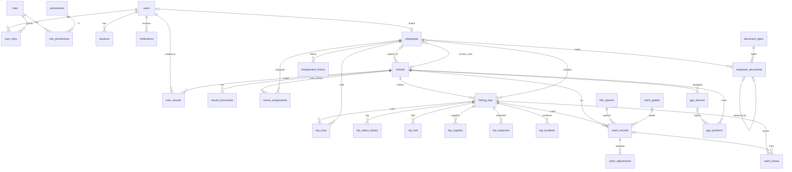

# ER Diagram (Phase 1)

```mermaid
erDiagram
  users ||--o{ user_roles : has
  roles ||--o{ user_roles : grants
  roles ||--o{ role_permissions : has
  permissions ||--o{ role_permissions : in
  users ||--o{ user_vessels : scoped_to
  vessels ||--o{ user_vessels : scope
  users ||--o{ sessions : has
  users ||--o{ notifications : receives
  users |o--o| employees : linked

  vessels ||--o{ vessel_documents : has
  employees |o--o{ vessels : captain_of
  vessels ||--o{ vessel_assignments : crew_history
  employees ||--o{ vessel_assignments : assigned
  vessels |o--o{ employees : current_crew
  employees ||--o{ employee_documents : holds
  document_types ||--o{ employee_documents : typed
  employee_documents |o--o| employee_documents : replaced_by
  employees ||--o{ employment_history : history

  vessels ||--o{ fishing_trips : makes
  employees |o--o{ fishing_trips : captains
  fishing_trips ||--o{ trip_crew : crew
  employees ||--o{ trip_crew : sails
  fishing_trips ||--o{ trip_status_history : log
  fishing_trips ||--o{ trip_fuel : fuel
  fishing_trips ||--o{ trip_supplies : supplies
  fishing_trips ||--o{ trip_expenses : expenses
  fishing_trips ||--o{ trip_incidents : incidents

  fishing_trips ||--o{ catch_records : catch
  vessels ||--o{ catch_records : by
  fish_species ||--o{ catch_records : species
  catch_grades |o--o{ catch_records : grade
  catch_records ||--o{ catch_adjustments : adjusted
  fishing_trips ||--o{ catch_losses : losses
  catch_records |o--o{ catch_losses : from

  vessels ||--o{ gps_devices : equipped
  gps_devices |o--o{ gps_positions : reports
  vessels ||--o{ gps_positions : track
```
Standalone: `files`, `audit_logs`, `app_settings`, `doc_sequences`
